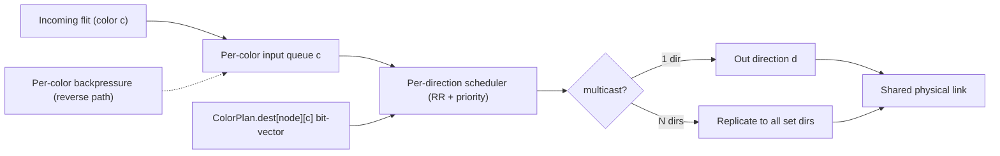

# Color NoC: Virtual-Network + Static-Routing Design and Simulation

## 1. What "color" is (grounded in US10,515,303)

A **color** is a virtual network overlaid on one physical 2D mesh. Per the patent (cols. 34-38):
- 16 colors typical (also 8/24/32). Each color has **dedicated per-color buffering** but **shares physical links** -> non-blocking isolation between colors, low area.
- Each color is a **fixed static routing pattern**: "All data that flows within a color always flows in accordance with the fixed routing pattern. There are no dynamic routing decisions." Implemented as `Dest[node][color] -> bit-vector over 7 directions` (X+/X-/Y+/Y-/skipX+/skipX-/On-Off-Ramp). Multiple set bits = **in-router multicast replication**.
- **Per-color flow control**: independent backpressure per color, asserted at per-color queue full; backpressure travels the reverse of the fixed route, turning each hop's per-color queue into a distributed in-fabric FIFO.
- **Ordering is structural**: "single active input source per color at a time" + one buffer per color + a single deterministic route => intra-color FIFO order, no intra-color congestion.
- **Dual role**: on arrival the color field selects the handler task (`instr_addr = base + color*4`), so a color is simultaneously a virtual-network ID and a task selector.
- **Deadlock** is possible on a general fabric; relies on watchdog + software-imposed acyclic dependencies.

This phase produces `docs/color_mechanism_analysis.md` capturing the above plus Sections 2-3 below.

## 2. The full color-scheme design space (the "enumerate all possibilities" deliverable)

A single color's fixed routing is a forwarding function on the mesh. The complete primitive space (documented + each implemented as a builder):
- **Path/line color** (1->1 fixed path, e.g. XY or YX): systolic / nearest-neighbor streaming.
- **Ring color** (row-ring, column-ring, snake/Hamiltonian, nested 2D ring): ring all-reduce, partial-sum.
- **Multicast tree color** (1->N spanning tree, router replication): activation broadcast / high fan-out.
- **Reduction tree color** (N->1 reverse tree, in-network combine at routers): partial-sum reduction.
- **Dimension-exchange / butterfly color *set*** (one color per stride-2^k stage): recursive-halving-doubling all-reduce, all-gather.
- **All-to-all color *set*** (time-phased disjoint permutations / Latin-square phases): MoE expert dispatch+combine.
- **Row-bus / Column-bus colors** (per-row X-bus, per-column Y-bus): 2D-decomposed collectives.

The **allocation problem** (the design knob that actually matters): with only K colors, map required virtual networks (flows) onto K colors so that (a) temporally-overlapping flows get **distinct** colors (isolation), (b) temporally-disjoint flows **reuse** colors, (c) link sharing is **load-balanced** to shrink makespan, (d) each color's route graph stays **acyclic / turn-restricted** (or a credit-bounded ring) for deadlock-freedom. Allocation strategies to compare: greedy-by-load, graph-coloring of a flow-conflict graph, and an ILP (the repo already ships `pulp`) minimizing peak link load subject to color budget K.

## 3. Per-pattern color designs (optimized for makespan)

- **Intra-layer partial-sum reduce**: column reduction-tree colors (+ ring color for ring-reduce comparison).
- **Inter-layer activation broadcast**: row multicast-tree / row-bus colors.
- **AllReduce**: ring colors (snake Hamiltonian) and butterfly color-set; pick per size.
- **AllGather / ReduceScatter**: dimension-exchange color-set + row/col-bus.
- **All-to-all (MoE)**: time-phased permutation color-set sized to avoid link hot-spots.
- **Systolic streaming**: path colors along rows/cols.
- **Mixed taxonomy goal**: a single K-color allocation (default K=16; sweep 8/24/32) that handles the mix; found by the allocator/optimizer in Phase 4.

## 4. Implementation (fresh, on `cerebras_color`; reuse existing primitives)

Build order, each module with pytest:

- **Color data model** - new `wsesim/network/color.py`: `Color(id, task)`, `ColorPlan` holding the patent `Dest` structure `dest[node][color] -> set[next_hop]` (multicast-capable). Extend `Flit`/`Packet` in [wsesim/network/packet.py](wsesim/network/packet.py) with `color: int` and `task: int`.
- **Static route builders** - new `wsesim/network/color_routes.py`: one builder per Section-2 primitive, each emitting `ColorPlan` fragments (per-node per-color output dirs) on a mesh graph from [wsesim/network/topology/mesh2d.py](wsesim/network/topology/mesh2d.py).
- **Per-color router** - extend [wsesim/network/router.py](wsesim/network/router.py) (or new `ColorRouter`): replace per-packet VC reservation (current `can_reserve_vc`/`active_vc_packets`) with **per-color input queues** (entries-per-color, patent `Data Queues 650`), a per-direction scheduler (round-robin + priority tiers, patent `Router Sched 654`/`Sent 662`), and multicast replication from the `Dest` bit-vector.
- **Per-color flow control** - new `wsesim/network/flow_control/per_color_credit.py` (alongside existing `credit_vc.py`/`wormhole.py`): per-color credits, reverse-path backpressure, distributed in-fabric FIFO; surfaces `color_buffer_wait_cycles` (already a column in `outputs/`).
- **Color-aware send** - rework `UnifiedNetwork.send_packet` in [wsesim/network/network.py](wsesim/network/network.py) to route by `ColorPlan.dest[current][color]` instead of `routing.next_hop(...)`, fork SimPy sub-processes at multicast branch points, and combine at reduce nodes.
- **Ordering guarantee** - enforce single-active-source-per-color (patent semantics); for all-to-all use time-phased colors. Add an order-checker that records per-(color) delivery sequence and asserts zero reordering; add `tests/test_color_ordering.py`.
- **Color allocation / optimizer** - new `wsesim/network/color_alloc.py`: greedy / graph-coloring / `pulp` ILP variants; deadlock check (per-color route DAG / turn restriction). Wire color-scheme knobs into [wsesim/dse/search/random.py](wsesim/dse/search/random.py) and score by makespan via `dse_score` in [wsesim/core/stats.py](wsesim/core/stats.py).
- **Partial-good fault tolerance** - new `wsesim/network/color_repair.py`: given a `DefectMap` ([wsesim/fault/defect_map.py](wsesim/fault/defect_map.py)), prune via `UnifiedNetwork.remove_dead_components`, then **recompute each color's route preserving its shape** (ring->detour-repair, tree->subtree reconnect) and model row/column redundancy harvesting. Metric: makespan vs defect-rate + routable-coverage fraction.

## 5. Workloads and simulation study

- **Pattern generators** - extend [wsesim/network/collective.py](wsesim/network/collective.py) (already has ring / RHD / 2d_ring / direct_allgather / hierarchical) and add broadcast-tree, reduction-tree, all-to-all, systolic, and the mixed workload.
- **Baseline** - single VN (K=1) + dimension-order XY shortest-path (existing [wsesim/network/routing/dimension_order.py](wsesim/network/routing/dimension_order.py)) carrying all traffic on one network.
- **Sizes** - 4x4, 8x8, 16x16 (256 PEs), flit-level cycle-accurate (SimPy).
- **Harness** - scripts under `examples/` writing `outputs/color_vs_xy_{4x4,8x8,16x16}/results.csv` + `*_meta.json` + cycle traces (reuse existing `outputs/` schema: `makespan_cycles`, `avg_latency`, `avg_link_util`, `color_buffer_wait_cycles`, `total_flits`). Plots via [wsesim/dse/plot.py](wsesim/dse/plot.py).
- **Claims to demonstrate**: color scheme reduces makespan vs single-VN XY across every pattern and the mix; ordering-violation count = 0; deadlock watchdog never trips; makespan degrades gracefully under increasing defect rate.

## 6. Defaults / assumptions (flag if you disagree)

- K = 16 colors default, sweep {8, 24, 32}. Flit = 128 B. Router 4-stage pipeline (existing default).
- "Enumerate all possibilities" = the documented primitive taxonomy + allocation strategies in Section 2, not a literal infinite list.
- Ordering enforced via patent single-active-source-per-color; all-to-all uses time-phased colors.
- Deadlock-freedom via acyclic/turn-restricted per-color route graphs (rings credit-bounded).
- ILP allocation via `pulp` with a greedy heuristic fallback.

## Data flow of the per-color router

