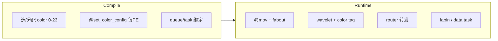

# Cerebras Color 机制速查

> **精简版** · 对应完整研读 `[Cerebras_Color_机制研读_v0.1.md](./Cerebras_Color_机制研读_v0.1.md)`（v3）  
> **来源**: [Cerebras SDK 2.10.0](https://sdk.cerebras.net/) + `company/cerebras/` HC PDF  
> **日期**: 2026-05-21

---

## 30 秒版

- **Color** = fabric 上 24 条虚拟通道（ID 0–23），compile 时配路由，**不是** runtime 按 src/dst 选。
- **Wavelet** 带 5-bit color tag；router 按 `(PE, color)` 的 rx/tx/switch 转发。
- **WSE-2**：DSD 里写 `fabric_color` 即发；**WSE-3**：queue 绑 color，DSD 只写 queue，换 color 要 `@queue_flush`。
- **稀缺资源（WSE-3）**：不是 24 个 color，而是 **8 个 output queue**。

---

## Color 是什么


| 层      | 要点                                                                                                                                                         |
| ------ | ---------------------------------------------------------------------------------------------------------------------------------------------------------- |
| **硬件** | 每 PE 5-port router；24 static routes = colors；per-color buffer、non-blocking；多 color TDM 共享物理 link（HC2022 Slide 17）                                          |
| **软件** | 24 routable colors；wavelet = 16b data + 5b color tag；color 决定 **fabric 路由 + 接收 task**（[Conceptual View](https://sdk.cerebras.net/computing-with-cerebras)） |


---

## 三问速答


| #   | 问题              | 精华答案                                                                                                |
| --- | --------------- | --------------------------------------------------------------------------------------------------- |
| 1   | **怎么确定 color？** | **Compile/layout** 静态定：手动 `@get_color` + `@set_color_config`，或 SdkLayout symbolic/connect 自动分配 0–23 |
| 2   | **传输中会变吗？**     | **Tag 默认不变**（WSE-2 Color Swap 例外）；**per-PE 路由状态**可经 switch/control wavelet 变；TDM 不改 color ID        |
| 3   | **怎么传数据？**      | Compile 接线 → `@mov` + `fabout_dsd` 发送 → mesh 逐 hop 转发 → `fabin_dsd` 或 data task 接收                  |


---

## 1. 怎么确定 Color（三条路径）

```
复杂度递增：A 手动 layout  →  B SdkLayout paint  →  C port connect 自动找路
```


| 路径    | 你做什么                                              | 编译器做什么                               |
| ----- | ------------------------------------------------- | ------------------------------------ |
| **A** | `@get_color(n)` + 每 PE `@set_color_config(rx/tx)` | 注入 param 到各 tile                     |
| **B** | `Color('c')` + `paint` + `set_param_all(c)`       | symbolic → physical，输出 `colors.json` |
| **C** | `create_*_port` + `layout.connect(tx, rx)`        | 自动找 mesh 路径 + 分配 color               |


**必记约束**

- 一个 program **只能一个 layout**（compile-time 固定）。
- 部分 color **reserved**（memcpy 等）；实际可用 < 24。
- **没有**「每个包 runtime 查 src/dst 选 color」——端点是 **port / 通信关系**，不是 packet 字段。

---

## 2. 传输中三层语义（别混谈）


| 层面                     | 变不变         | 说明                                                          |
| ---------------------- | ----------- | ----------------------------------------------------------- |
| Wavelet **color tag**  | 通常不变        | WSE-2 **Color Swap** 可在 router 上 red↔blue 翻转；WSE-3 不支持      |
| PE 上 **该 color 的路由状态** | 可以变         | Control wavelet / `advance_switch` 改 switch pos（pos0→1→2→3） |
| **物理 link**            | color ID 不变 | 多 color 时分复用同一条 link                                        |


**常见误区**


| 错误说法                 | 正确理解                   |
| -------------------- | ---------------------- |
| Color 永远不变           | Swap / Switch 都可能改变行为  |
| TDM 会改 color         | TDM 共享 link，不改 0–23 编号 |
| Runtime 换 color 传同一流 | 无通用机制（除 Swap 等特殊配置）    |


---

## 3. 数据传输流程

```
Compile:  color ID + @set_color_config(每PE) + @initialize_queue + @bind_data_task
          ↓
Send:     Memory ──@mov(async)──► fabout_dsd ──► oq ──► RAMP ──► Router
          ↓
Fabric:   读 wavelet.color tag → 查 (PE,color) 的 tx/switch → 下一 hop
          ↓
Recv:     Router → RAMP → input queue → data task 或 fabin_dsd → Memory
```


| 端       | WSE-2                               | WSE-3                                                          |
| ------- | ----------------------------------- | -------------------------------------------------------------- |
| 发送      | `fabout_dsd { .fabric_color = tx }` | `fabout_dsd { .output_queue = oq }`，oq 已 bind color            |
| 接收 task | `@get_data_task_id(color)`          | `@get_data_task_id(iq)` + `@initialize_queue(iq, .{ .color })` |
| 中间 PE   | `.rx=WEST, .tx=EAST` 透明转发           | 同左                                                             |


---

## WSE-2 vs WSE-3 精华对比

> SDK 同一套，编译时 `--arch=wse2` / `--arch=wse3`；WSE-3 自 SDK 1.1.0 支持 CS-3。


| 维度                     | WSE-2                   | WSE-3                                  |
| ---------------------- | ----------------------- | -------------------------------------- |
| Color 数量               | 24                      | 24（fabric 层不变）                         |
| **谁决定发哪条 color**       | **DSD `.fabric_color`** | **queue 绑定的 color**                    |
| Output queue           | 一 oq 可发多 color          | **一 oq 同时只绑一 color**                   |
| Data task 触发           | color ID (0–23)         | input queue ID (0–7)                   |
| Queue ↔ Microthread    | 耦合（queue ID = ut ID）    | **解耦**（各 0–7 任意配）                      |
| 换发送 color              | 改 DSD 即可                | drain oq + `@queue_flush` + handler 重绑 |
| Color Swap / CE Inject | 支持                      | **不支持**                                |
| Switch 可配 color        | 全部 24                   | **仅子集**（0–9,12–13,16–17,20–21）         |
| 单 DSD 双 fabin          | 允许                      | **最多 1 个**（需 FIFO 中转）                  |


### WSE-3 变化意味着什么（一句话）

**Fabric 层 color 哲学未变**；**CE 接口从「包贴 color 标签」变成「queue 配线路再灌数据」**——瓶颈从 color 数变成 **8 个 oq + ut 规划**。

### WSE-3 换 color 最小流程（同一 oq）

```
@mov → oq(C10) → done_transmit → @queue_flush(oq) → oq empty → T29 handler
→ encode_output_queue(oq, C12) → queue_flush.exit → @mov → oq(C12)
```

**铁律**：microthread 结束 ≠ queue empty；同一 ut 不能并发两路 fabric 操作。

---

## 附录精华

### Collective（`collectives_2d`）

- MPI 风格：**broadcast / scatter / gather / reduce_fadds**（同行或同列 PE）。
- 程序员分配：**X 用 color 0/1，Y 用 color 4/5**；queue 默认 X=2/4，Y=3/5。
- 调用 `c2d.get_params(Px,Py,...)` → 库内部写每 PE 路由；用户只调 `mpi_x.broadcast()` 等。
- **用库则 WSE-2/3 差异被吸收**；手写 fabric 则需自己处理 WSE-3 queue 约束。

### Filter（per-PE per-color 接收侧）


| Kind               | 丢弃条件                                                         |
| ------------------ | ------------------------------------------------------------ |
| **counter**        | counter > `max_counter` 的 wavelet reject                     |
| **sparse_counter** | 周期性稀疏，limit 到达后 filter 可 disable                             |
| **range**          | data wavelet 的 index ∉ [min_idx, max_idx] reject；control 一律过 |


- Reject = **不上 RAMP**；**不改** wavelet color tag。
- 例：Topic 16 中 C12 每 15 个 wavelet 只收前 2 个。

### Microthread + Queue 复用（WSE-3）


| 场景                                  | 允许？                 |
| ----------------------------------- | ------------------- |
| 同 oq、不同 ut 并发 `@mov`                | ✅                   |
| 同 ut 并发两 fabric 操作                  | ❌                   |
| 同 oq 未 drain 换 color                | ❌                   |
| iq 收完再 `encode_input_queue` 换 color | ✅（通常不需 queue_flush） |


---

## NoC 仿真建模要点（推断）


| 对象       | 建议                                                        |
| -------- | --------------------------------------------------------- |
| Color 表  | Compile 一次生成 `(pe, color) → {rx, tx, switch_pos, filter}` |
| Wavelet  | 固定 `color_id` + 16b payload                               |
| 拥塞       | Per-color buffer 独立                                       |
| 物理 link  | 多 color 统计复用带宽                                            |
| WSE-3 发送 | 建模 `(pe, oq) → bound_color` + queue_empty 事件              |
| **不要建模** | runtime `(src,dst) → color` 查表                            |


---

## 常见误区清单

1. ❌ 「runtime 按 src/dst 选 color」→ ✅ compile/layout 静态分配
2. ❌ 「物理 link TDM = color 改变」→ ✅ 只是共享 link
3. ❌ 「WSE-3 color 变多了」→ ✅ 仍 24 个，变的是 queue 绑定语义
4. ❌ 「collectives 要手写每跳路由」→ ✅ `collectives_2d` 库封装
5. ❌ 「filter 会改 color tag」→ ✅ 只影响是否递交 RAMP

---

## 关键 SDK 入口


| 主题               | 链接                                                                                                                                                                                                                                                                                                                                                                                          |
| ---------------- | ------------------------------------------------------------------------------------------------------------------------------------------------------------------------------------------------------------------------------------------------------------------------------------------------------------------------------------------------------------------------------------------- |
| 总览               | [A Conceptual View](https://sdk.cerebras.net/computing-with-cerebras)                                                                                                                                                                                                                                                                                                                       |
| 路由/Filter/Switch | [Builtins — `@set_color_config](https://sdk.cerebras.net/csl/language/builtins)`                                                                                                                                                                                                                                                                                                            |
| 收发 DSD           | [DSDs](https://sdk.cerebras.net/csl/language/dsds)                                                                                                                                                                                                                                                                                                                                          |
| WSE-3 专用         | [builtins_wse3](https://sdk.cerebras.net/csl/language/builtins_wse3) · [microthreads_wse3](https://sdk.cerebras.net/csl/language/microthreads_wse3)                                                                                                                                                                                                                                         |
| 示例               | [SdkLayout 2/3](https://sdk.cerebras.net/csl/code-examples/tutorial-sdklayout-02-routing) · [Topic 6 Switches](https://sdk.cerebras.net/csl/code-examples/tutorial-topic-06-switches) · [Topic 11 Collectives](https://sdk.cerebras.net/csl/code-examples/tutorial-topic-11-collectives) · [Topic 16 Queue Flush](https://sdk.cerebras.net/csl/code-examples/tutorial-topic-16-queue-flush) |
| 硬件               | `HC2022` Slide 17（24 colors）；`HC2024` 仅 Fabric 框图                                                                                                                                                                                                                                                                                                                                           |


---

## 一张总图




---

*需要论证细节、引用原文或 WSE-3 展开解读 → 见完整版 `[Cerebras_Color_机制研读_v3.md](./Cerebras_Color_机制研读_v0.1.md)`。*