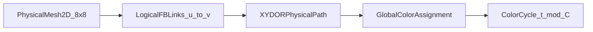

# 8x8 TDM Flattened Butterfly on Physical Mesh2D

本文档描述在 8x8 物理 mesh NoC 上，以全局 cycle 级 `color` 时分方式实现 flattened butterfly（FB）逻辑拓扑，并给出 `(k,n)=(8,2)/(4,3)/(2,6)` 的集合通信映射与性能对比方法。

## 双层拓扑模型

- **物理层**：8x8 `mesh2d`，链路仍是相邻节点点到点。
- **逻辑层**：`k^n=64` 的 FB，每个维度上节点与同维其他 `k-1` 节点建立逻辑长链路。
- **映射**：每条逻辑长链路 `(u,v)` 经 XY DOR 映射为一条物理有向路径。

## Color 调度规则

- 对所有逻辑长链路做全局边着色，得到 `ColorPlan`：
  - `C`: color 总数（周期长度）
  - `link_active[(p_src,p_dst)][c]`: 物理有向边在 color `c` 下激活的逻辑长链路
  - `color_of_logical[(u,v)]`: 逻辑长链路所属 color
- 在 cycle `t` 只有 `color=t mod C` 的链路可前进 1 flit。
- flit 到达中间节点后若当前 color 不匹配其逻辑链路 color，则等待到匹配 color 再发出。

## (k,n) 变体

- `(8,2)`：二维高 radix，逻辑直连密度高，color 下界通常较高。
- `(4,3)`：三维中 radix，跨维路径重叠更均衡。
- `(2,6)`：六维超立方退化，单维度冲突较小但 stage 数更多。

## 集合通信映射

- **allreduce**：`nd_dimension_exchange_allreduce`
  - 按维度串行 stage。
  - 每个 stage 在对应维度的 `k` 节点组内执行：
    - `k` 为 2 的幂：recursive halving-doubling
    - 否则：ring reduce-scatter + allgather
- **allgather**：`nd_dimension_exchange_allgather`
  - 按维度分 stage，在每个 `k` 节点组内 direct allgather。

## 与 mesh2d 包交换对比

脚本：`examples/run_tdm_flatbf_8x8.py`

- 拓扑：`mesh2d_8x8_ps`、`tdm_fb_k8_n2`、`tdm_fb_k4_n3`、`tdm_fb_k2_n6`
- 集合：`allreduce`、`allgather`
- 消息：`1KB/16KB/256KB`
- 输出：`outputs/tdm_flatbf_8x8/results.csv`

建议关注列：

- `makespan_cycles`
- `avg_latency`
- `avg_link_util`
- `total_flits`

## 着色可视化与人工检视

脚本：`examples/visualize_tdm_coloring.py`

输出目录：`outputs/tdm_flatbf_8x8/coloring/`

- `k8_n2_overview.png` / `k8_n2_colors.png`
- `k4_n3_overview.png` / `k4_n3_colors.png`
- `k2_n6_overview.png` / `k2_n6_colors.png`

图中会标注：

- 每条物理边的负载 `load(e)`（overview）
- 每个 color 下激活的物理边及其逻辑链路 `u->v, dim`（colors）
- 若发现冲突会以红色高亮违规边

## 复杂度与代价

- `ColorPlan` 存储复杂度约为 `O(|physical_edges| * C)`
- TDM 会降低瞬时冲突但增加等待抖动；突发流在错过 color 时会出现额外排队
- 高 radix 方案（如 `(8,2)`）通常 color 下界更大，调度周期更长

