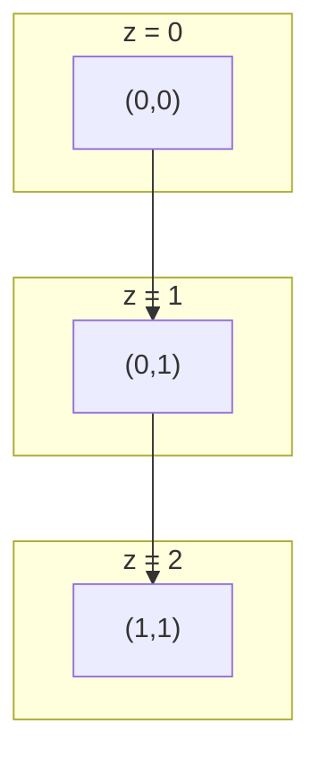
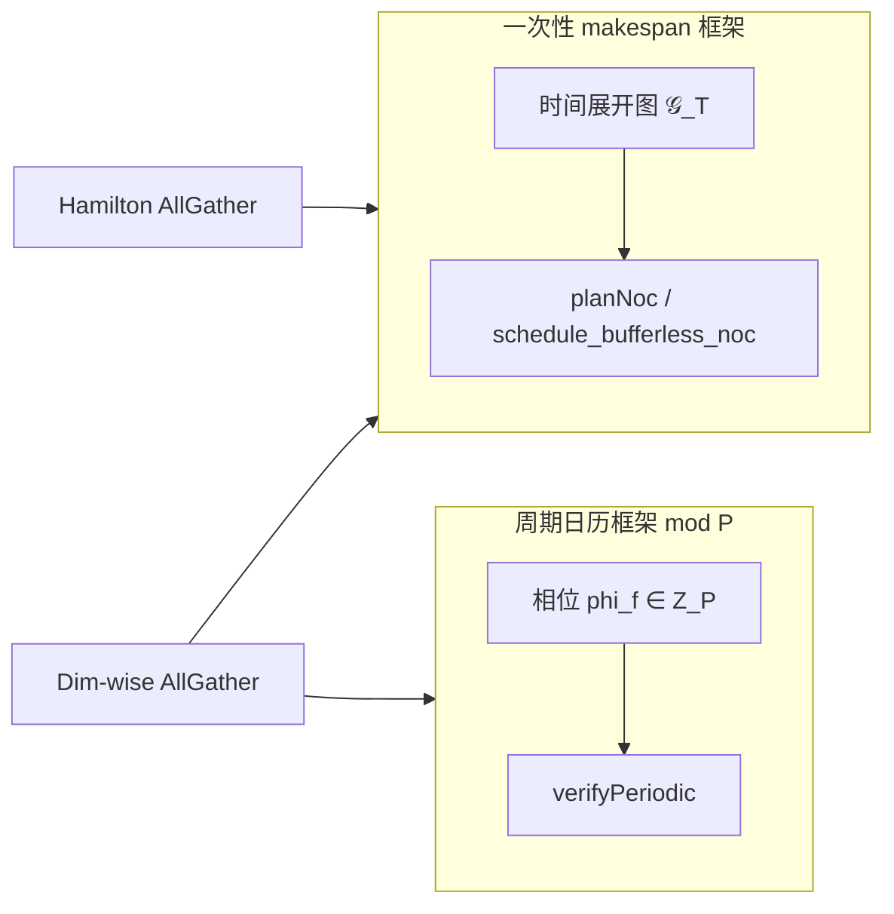

# 时间展开图（Time-Expanded Graph）与 2D Mesh 集合通信调度

> 本文档统一「长方体几何直觉 → 时间展开 DAG 形式化 → AllGather 最优构造 → 嵌入完美时隙日历框架」的完整推导链。
>
> 相关实现：`wsesim/network/collective_patterns.py` · 可视化/求解器：`docs/color_mesh_viz.html` · 日历语义：`docs/perfect_slot_calendar.md` · 哈密顿环专题 HTML：`docs/hamilton_ring_allgather.html`

---

## 0. 问题陈述

在 2D Mesh 上执行集合通信（以 **AllGather** 为主），要求：

1. **逐拍前进**：每个 flit 每 cycle 沿 Mesh 四邻 `(±x, ±y)` 之一移动恰好一跳（无驻留弧）；
2. **链路容量**：每条有向物理链路每 cycle 至多传输 1 个 flit；
3. **不可合流、可分叉**：任意中间节点在任意 cycle 的**入弧**至多 1 条（禁止两条线汇入同一链路）；出弧可 ≥ 1（多播/本地留存后继续转发）；
4. **最小 makespan**：完成一次 AllGather 的总 cycle 数尽可能小。

把 Mesh 在每一 cycle 的切片作为空间 `(x,y)`，把 cycle 编号作为时间 `z`，即可在三维长方体中可视化整条通信轨迹。

---

## 1. 几何直觉：长方体模型

设 Mesh 尺寸 `X × Y`（代码中 `cols × rows`），`N = XY` 个 PE。

| 轴 | 含义 |
|----|------|
| `x, y` | 2D Mesh 上 PE 坐标 |
| `z` | 离散时间（cycle / slot） |

**例**：从 `(0,0)` 到 `(1,1)` 的 XY 最短路径在长方体中对应折线：

```
cycle 0: (0,0,0)  ——→  cycle 1: (0,1,1)  ——→  cycle 2: (1,1,2)
```

即在 `z` 层之间，只允许连接 `(x,y,z) → (x±1,y,z+1)` 或 `(x,y,z) → (x,y±1,z+1)` 的边。



**禁止合流**在几何上即：在任意固定 `z`，不允许两条来自 `z−1` 的边指向**同一条** `(u→v)` 有向链路（同一 `(u,v,z)` 占用）。

**允许分叉**即：同一 `(v,z)` 顶点可有多条出弧指向不同邻居（本地复制 + 继续转发），或一条出弧 + 本地 eject（不占链路）。

---

## 2. 形式化：时间展开 DAG

### 2.1 静态 Mesh

无向 Mesh 图 `G = (V, E)`：

- `V = {(x,y) : 0 ≤ x < X, 0 ≤ y < Y}`
- `(u,v) ∈ E` 当且仅当 `u,v` 四邻且曼哈顿距离 1

### 2.2 时间展开图 𝒢_T

给定 makespan 上界 `T`，构造 DAG `𝒢_T = (𝒱_T, 𝒜_T)`：

- **顶点**：`𝒱_T = V × {0,1,…,T}`
- **弧（bufferless 模型）**：`(v, z) → (w, z+1)` 当且仅当 `(v,w) ∈ E`，`z ∈ [0, T−1]`
- **无 hold 弧**：不存在 `(v,z) → (v,z+1)`（router 不 stall 的 bufferless 语义）

每条弧容量为 **1 flit**。

### 2.3 通信需求

AllGather：每个节点 `s ∈ V` 持有 1 个 flit，最终每个节点需持有全部 `N` 个 flit。

抽象为：对每个源 `s`，需构造一棵**出树（arborescence）**覆盖所有节点（每个节点至少收到来自 `s` 的一份拷贝），或等价地，在 `𝒢_T` 中为每个源放置一条从 `(s,0)` 出发、沿弧前进的路径族（允许在节点处分叉复制）。

### 2.4 四条约束的数学表述

| 编号 | 自然语言 | 形式化 |
|------|----------|--------|
| C1 | 每拍四邻之一 | flit 轨迹是 `𝒢_T` 中的有向路径；每步 `z` 增加 1 |
| C2 | 每链路 1 flit | `∀ (v,w), z :` 占用弧 `((v,z),(w,z+1))` 的 flit 数 ≤ 1 |
| C3 | 不可合流 | 对每个 `(v,z)`（`z≥1`），入弧数 ≤ 1；出弧数 ≥ 1（分叉时 >1 表多播） |
| C4 | 最小 makespan | 最小化 `T`，使所有节点的接收需求被满足 |

**合流与容量**：C3 比 C2 更强——C2 只限制**链路**层，C3 还禁止两个 flit 在同一节点同一 cycle **竞争同一出链路**之前的「汇聚」；在 bufferless 模型下，两者合并为：**每个 `(有向边 e, 时隙 t)` 至多一个 flit**。

### 2.5 问题等价类

> 在 `𝒢_T` 中，为 AllGather 的所有源构造**弧不相交**的 Steiner 出森林；最小化 `T`。

一般情形：网格上的不相交路径 + 多commodity 调度为 **NP-hard**。

结构化 collective（AllGather / AllReduce / …）则可用：

- **下界**：割容量、度数、直径 → 给出 `T*` 或周期 `P` 下界；
- **上界**：显式构造（维度交换、哈密顿环、多播树）→ 证明可达最优。

**Leighton–Maggs–Rao 型结论**（一般路由）：任意路径系统存在 `O(C + D)` 的无冲突调度（`C` = 最大边负载，`D` = 最长路径）。对 AllGather 我们给出**精确达到**角节点接收度下界的显式构造，无需通用定理的常数松弛。

---

## 3. 下界工具

### 3.1 边负载下界 L*（周期日历）

对**周期性稳态**调度，定义：

```
L* = max_{有向边 e}  (经过 e 的流条数)
```

若帧长为 `P`，每帧每条边最多传 1 flit，则 **`P ≥ L*`**。详见 `docs/perfect_slot_calendar.md` §2。

> **注意**：`L*` 是**稳态每帧**的边负载，与 **makespan** `T*` 是不同量纲。Dim-wise AllGather 在 4×4 上 `L*=2` 但 bufferless makespan 可达 30；哈密顿环 `L*` 在单帧内不同，但 makespan `T*=8` 达到接收度下界。

### 3.2 接收度下界（开放 Mesh AllGather）

角节点度数 = 2。完成 AllGather 需接收 `N−1` 个外来 flit，每 cycle 至多从 2 条入链路各收 1 个：

```
T ≥ ⌈(N−1) / 2⌉
```

对 4×4 / 8×8 / 12×16，该下界**严格紧于**直径下界 `X+Y−2` 与对分下界 `X/2`。

### 3.3 割下界（一般形式）

对任意弧集割 `(S, V\S)`，每 cycle 穿越割的 flit 数 ≤ `|δ(S)|`（割边数）。AllGather 需传过割的 flit 总量与需求集相关，给出：

```
T ≥ ⌈ 需穿越割的 flit 总数 / |δ(S)| ⌉
```

角节点接收度下界是割 `S = {角点}` 的特例。

---

## 4. AllGather：Dim-wise RHD（现有 XY 日历流量）

### 4.1 算法结构

实现：`build_dimwise_allgather_flows()`（`collective_patterns.py` / `color_mesh_viz.html`）。

两阶段 **Reverse-Hypercube-Dimension (RHD)** 双向交换：

1. **X 维**：stride 按 `…, 4, 2, 1` 递减；每 stage flit 数随 `blocks` 倍增；
2. **X→Y 换维**：PE 进出惩罚 `PE_INOUT_LATENCY = 10` cycles（数据落 PE 再注入）；
3. **Y 维**：同上，初始 `blocks = cols`。

每对 partner 产生 **XY 路由** 的双向流 `(ab)` / `(ba)`，各自独立 color。

### 4.2 周期日历视角

Dim-wise AllGather 在 `P = L*`、`T=1`（每跳 +1）下**存在**完美周期相位解（`verifyPeriodic` 通过）：

| Mesh | 流数 | L* | T=1 @ P=L* |
|------|------|-----|------------|
| 4×4  | 64   | 2  | 可行       |
| 8×8  | 384  | 5  | 可行       |

相位交替即可消解同一 stride 内双向流的少量边共享。

### 4.3 Bufferless makespan 瓶颈

周期可行 **≠** 零 stall makespan 最优。一次性 bufferless 调度（`planNoc`）中，Dim-wise 第二阶段 Y 向扩张时，列端点仅 **1 条入链**却要串行接收大量 flit：

```
T_dim ≥ (X−1) + X(Y−1) = N − 1     （开放 Mesh，XY 路径必经列端 bottleneck）
```

约为接收度下界 `⌈(N−1)/2⌉` 的 **2 倍**——因为每阶段只启用 Mesh 的一个维度子集，**未打满角节点两条链路的全程带宽**。

---

## 5. AllGather：哈密顿环双向流水线（最优构造）

### 5.1 核心观察

开放 Mesh 的 AllGather 瓶颈在**角节点接收度 2**。最优策略：让角节点两条链路在**每一 cycle** 都满载接收新 flit——哈密顿环恰好使 `N` 条有向环边每 cycle 各传 1 flit，利用率 100%。

### 5.2 蛇形哈密顿环（X 为偶数）

要求 `cols`（X 维）为偶数。构造（`build_hamilton_cycle()`）：

```
列 0 向上：(0,0)→(0,1)→…→(0,Y−1)
列 1 向下：(1,Y−1)→…→(1,1)          （跳过 y=0，留给闭合段）
列 2 向上：(2,1)→…→(2,Y−1)          （从 y=1 起，保证 (1,1)→(2,1) 邻接）
…
末列奇数列结束后，沿 y=0 向西补未访问节点，闭合回 (0,0)
```

**4×4 完整环序**（16 个节点）：

```
 0:(0,0) →  1:(0,1) →  2:(0,2) →  3:(0,3)
→ 4:(1,3) →  5:(1,2) →  6:(1,1)
→ 7:(2,1) →  8:(2,2) →  9:(2,3)
→10:(3,3) → 11:(3,2) → 12:(3,1)
→13:(3,0) → 14:(2,0) → 15:(1,0) → 回到 0:(0,0)
```

**π(15)→π(0)** 即 **(1,0)→(0,0)**，沿底行 y=0 向西的一跳。

每条物理有向边在环上**至多出现一次**；`N` 个节点恰访一次。

### 5.3 时隙表（全源 z=0 同时注入）

记环序 `π(0),…,π(N−1)`，`T* = ⌈(N−1)/2⌉`。

**时隙 `z`（`z = 0,…,T*−1`）**：

| 方向 | 边 | 承载源 |
|------|-----|--------|
| 顺时针 CW | `π(j) → π(j+1)` | 源 `π(j−z)` |
| 逆时针 CCW | `π(j) → π(j−1)` | 源 `π(j+z)` |

（下标 mod `N`。）

**实现**：每个源 `s` 产生 2 条链式流（CW / CCW），hop `h` 占用 slot `h`（`phi=0`，刚性 +1/hop）。

### 5.4 正确性

**无冲突**：固定 `z`，CW 边 `j` 的源为 `π(j−z)`；不同 `j` 源不同。CCW 同理。CW 与 CCW 使用反向有向边，不共享。

**无合流**：每条流是简单链（每中间节点入度 1）。

**覆盖**：`z = T*−1` 后，每节点沿 CW/CCW 各收到距离 ≤ `T*` 的 flit，共 `2T*+1 ≥ N` 份（含自身）。

**最优**：

```
makespan = T* = ⌈(N−1)/2⌉
```

等于 §3.2 接收度下界。

### 5.5 与 Dim-wise 实测对比

调度模型：bufferless rigid +1/hop（`schedule_bufferless_noc` / `planNoc`）。Hamilton 预分配 slot，stall = 0。

| Mesh   | N   | T* = ⌈(N−1)/2⌉ | Hamilton makespan | stall | Dim-wise makespan | Dim-wise stall | 加速比 |
|--------|-----|----------------|-------------------|-------|-------------------|----------------|--------|
| 4×4    | 16  | 8              | **8**             | **0** | 30                | 244            | 3.75×  |
| 8×8    | 64  | 32             | **32**            | **0** | 101               | 47 296         | 3.16×  |
| 12×16  | 192 | 96             | **96**            | **0** | 393               | 2 727 816      | 4.09×  |

数据来源：`outputs/hamilton_allgather/results.json`（`pytest tests/test_hamilton_allgather.py`）。

Dim-wise 的高 stall 来自 **一次性贪心定序** + 大量顺序注入，非周期不可行；周期求解器仍证明其 `P=L*, T=1` 稳态日历存在。

### 5.6 边界情形

| 情形 | 处理 |
|------|------|
| `X` 奇数 | 无哈密顿环；删一多数色顶点后构造，被绕开节点经邻居代理，makespan +O(1) |
| 严格 one-port（每节点每拍仅 1 出链） | 与「允许分叉」矛盾；单向环 makespan `N−1`，仍最优 |
| Torus 回绕 | 2 条边不相交哈密顿环 → 4 流水线，`T* = ⌈(N−1)/4⌉` |

---

## 6. 嵌入日历框架

项目中有 **两套互补的时间语义**，时间展开图同时解释二者。

### 6.1 两套时间尺度

| 概念 | 符号 | 语义 | 典型用途 |
|------|------|------|----------|
| **Makespan** | `T*` 或 `duration` | 单次 collective **完成**所需 cycle 数 | 哈密顿环、一次性 `buildCalendarSchedule` |
| **周期帧长** | `P` | 稳态日历重复周期 `mod P` | 完美时隙中继（方案 5）、全局轮转（方案 4） |
| **中继容忍** | `T`（日历） | 每跳推进 ∈ `[1,T]`；`T=1` ⇒ 每跳恰好 +1 | `buildPeriodicCalendar(flows, P, T)` |

关系：

- 哈密顿 AllGather：**非周期**一次调度，`duration = T* = ⌈(N−1)/2⌉`，所有源 `release = 0`，slots `[0,1,…,T*−1]`。
- Dim-wise AllGather：**周期** `P = L*`，相位 `phi_f` 错开共享边；帧内 1 flit/流，帧重复承载多 flit 数据量。



### 6.2 方案 5：完美时隙中继日历（软件全控）

**定义**（`docs/perfect_slot_calendar.md`）：

- 每条流 `f`：XY 路径 `P_f = (e_0,…,e_{L−1})`，起始相位 `phi_f ∈ Z_P`；
- `T=1`：边 `e_h` 在 slot `(phi_f + h) mod P` 被占用；
- **无冲突**：`∀ f≠g, e_h = e'_k ⇒ phi_f + h ≢ phi_g + k (mod P)`。

**求解器**（`color_mesh_viz.html`）：

| 函数 | 作用 |
|------|------|
| `computeEdgeLoad(flows)` | 返回 `{L*, witness}` |
| `buildPeriodicCalendar(flows, P, T)` | 相位回溯 / 启发式 placement |
| `verifyPeriodic(flows, P, assign)` | 独立复核 `(edge, slot mod P)` |
| `buildPeriodicSchedule(...)` | 生成 Router Color Calendar 矩阵 |

**Python 侧**：流生成 `collective_patterns.build_dimwise_allgather_flows()`；负载 `compute_edge_load()`；一次性调度 `schedule_bufferless_noc()`。

Dim-wise AllGather 已验证：`P = L*`, `T = 1` 可行，`verifyPeriodic` 全通过。

### 6.3 方案 4：全局关联轮转日历

- 周期 `P = 2(N−1) + 2(M−1)`（mesh 周长型）；
- **方向**由全局 slot 固定（W→E, N→S, E→W, S→N 轮转）→ 空间 HW、**构造性无冲突**；
- **注入相位**由软件按 `(src,dst)` 选择 → 时间 SW。

时间展开图视角：方案 4 将 `𝒢_T` 中可选弧集限制为**每 slot 仅一个 compass 方向**，大幅剪枝搜索空间，牺牲 makespan 换取零冲突硬件门控。

### 6.4 一次性 Bufferless 调度（planNoc）

`buildCalendarSchedule(flows, policy="noc")` / `schedule_bufferless_noc()`：

- 按 `release` 排序流，对每条 flit **刚性 +1/hop** 占位 `(edge, t)`；
- 冲突则 **源端 stall**（`PE:wait`），不引入 router buffer；
- makespan = max(末跳 arrival) + 1；`total_stall` 统计源端等待。

这是时间展开图上 **在线贪心 arc packing**：不是周期日历，但验证「给定流集合是否低 stall」。

Hamilton AllGather 通过 **预分配 slots**（`verify_preassigned_slots`）证明 `stall=0` 且 `peak=1`。

### 6.5 Hamilton AllGather 作为闭式日历特例

哈密顿环方案**不需要** `buildPeriodicCalendar` 搜索，闭式给出全部 `(edge, slot)` 占用：

```python
flows, t_star, meta = build_hamilton_ring_allgather_flows(rows, cols)
result = verify_preassigned_slots(flows)
# result.makespan == ceil((N-1)/2), result.total_stall == 0, result.peak == 1
```

**嵌入方案 5 的等价描述**：

- 若将 `P = T*`，`phi_f = 0`，每条 CW/CCW 链 hop `h` 占 slot `h mod P`；
- `verifyPeriodic` 与 `verify_preassigned_slots` 在该实例上等价（无 `mod` 冲突因 `h < P`）；
- Router 规则静态：**环入 → 环出**（两方向），状态成本为五方案中最低档。

**嵌入 SimPy 方案 5 驱动链**（计划 `perfect_calendar.py`）：

```
build_hamilton_ring_allgather_flows
  → verify_preassigned_slots / verifyPeriodic
  → buildPeriodicSchedule（或 Python 等价）
  → UnifiedNetwork 按 slot 注入，router 不 stall
```

### 6.6 代码与文档映射

| 层次 | 文件 / 符号 | 角色 |
|------|-------------|------|
| 流生成 | `collective_patterns.build_*_allgather_flows` | 产出 `CollectiveFlow{path, release, slots?}` |
| 边负载 | `compute_edge_load` ↔ JS `computeEdgeLoad` | 周期下界 `L*` |
| 预分配验证 | `verify_preassigned_slots` | Hamilton：无冲突 + stall=0 |
| 贪心调度 | `schedule_bufferless_noc` ↔ JS `planNoc` | Dim-wise 一次性 makespan |
| 周期求解 | JS `buildPeriodicCalendar` | Dim-wise：`P=L*, T=1` |
| 周期复核 | JS `verifyPeriodic` | 独立见证 |
| 可视化 | `color_mesh_viz.html` Periodic 模式 | 矩阵 + 泳道 |
| 专题 | `hamilton_ring_allgather.html` | 图示 + 对拍表 |
| 基准 | `outputs/hamilton_allgather/results.json` | 4×4 / 8×8 / 12×16 |

**CollectiveFlow 字段 ↔ 日历语义**：

| 字段 | 日历含义 |
|------|----------|
| `path[h]` | 第 `h` 跳有向边 `e_h` |
| `release` | 源端最早注入 cycle（= `phi` 在一次性框架中） |
| `slots[h]` | 边 `e_h` 被占用的绝对 cycle（Hamilton 闭式） |
| `color_id` | 方案 3/5 的 VN / color 编号 |
| `flits` | 同流重复帧数（稳态分析常取 1） |

---

## 7. 与五方案 NOC 研究的关系

（摘自 WSE FFN NOC 方案划分。）

| 方案 | 空间 | 时间 | 冲突 | 与时间展开图关系 |
|------|------|------|------|-------------------|
| 1 INC 多播 | HW | HW | HW | 树/环在 `𝒢_T` 中为 Steiner 出树；INC 硬件分叉 |
| 2 TDM FB | SW | HW | HW | 逻辑链路选择；独立 router 时隙表 |
| 3 Color 静态路由 | SW | HW | HW | 每 color 固定 XY 路径 → `𝒢_T` 中子图 |
| 4 全局轮转日历 | HW | SW | 构造性无 | 每 slot 只允许一个方向 → 子图剪枝 |
| 5 完美日历 | SW | SW | SW | **直接在 `𝒢_T` 上求 `(edge,t)` packing**；Hamilton 为闭式解 |

**AllGather 选型提示**：

- 若目标 **最小 makespan** 且可接受环路由（非 XY）：**Hamilton 双向流水线** 达 `⌈(N−1)/2⌉`；
- 若必须 **XY 维序** + 稳态 color 日历：Dim-wise `P=L*, T=1` 可行，但 makespan 受维序瓶颈；
- 若 **硬件最简单**：Hamilton 两方向静态转发；方案 4 方向门控亦简，但 `P` 更大。

---

## 8. 可复现实验

```bash
# 哈密顿 vs dim-wise 对拍（4×4, 8×8, 12×16）
pytest tests/test_hamilton_allgather.py -v

# 刷新 JSON + hamilton_ring_allgather.html 表格
python3 scripts/run_hamilton_allgather_verify.py

# 周期日历交互验证（Dim-wise 等 6 类 collective）
# 浏览器打开 docs/color_mesh_viz.html → Periodic 模式
```

**验收条件（Hamilton）**：

1. `makespan == ceil((N-1)/2)`；
2. `stall == 0`；
3. `peak == 1`（每 `(edge, slot)` 至多 1 flit）；
4. `verify_preassigned_slots.ok == True`。

---

## 附录 A：符号表

| 符号 | 含义 |
|------|------|
| `X, Y` | Mesh 列数、行数（`cols, rows`） |
| `N` | `XY` 节点数 |
| `𝒢_T` | 时间展开 DAG，makespan 上界 `T` |
| `T*` | 最优 makespan（AllGather 接收度下界 `⌈(N−1)/2⌉`） |
| `P` | 周期日历帧长 |
| `L*` | 最大有向边负载（周期下界 `P ≥ L*`） |
| `phi_f` | 流 `f` 的起始相位 |
| `π` | 哈密顿环节点序 |
| `CW / CCW` | 环顺时针 / 逆时针 |

---

## 附录 B：从长方体到整数规划的紧凑写法

**变量**：`x_{f,h,t} ∈ {0,1}` — 流 `f` 在第 `h` 跳于 cycle `t` 占用其路径边。

**约束**：

```
∑_f x_{f,h,t} ≤ 1                    ∀ 边 e, cycle t（C2）
x_{f,h,t} ≤ x_{f,h−1,t−1}             ∀ f, h>0（C1 刚性 +1/hop）
∑_{h,t: e_h=e, x=1} 满足 AllGather 需求
最小化 max{t : x_{f,h,t}=1}
```

Hamilton 构造给出一组可行 `{x}` 闭式解；Dim-wise 周期日历给出 `mod P` 的循环可行解；`buildPeriodicCalendar` 对一般流做相位搜索。

---

*文档版本：2026-06-10 · 与 `collective_patterns.py` / `perfect_slot_calendar.md` / `hamilton_ring_allgather.html` 同步*
