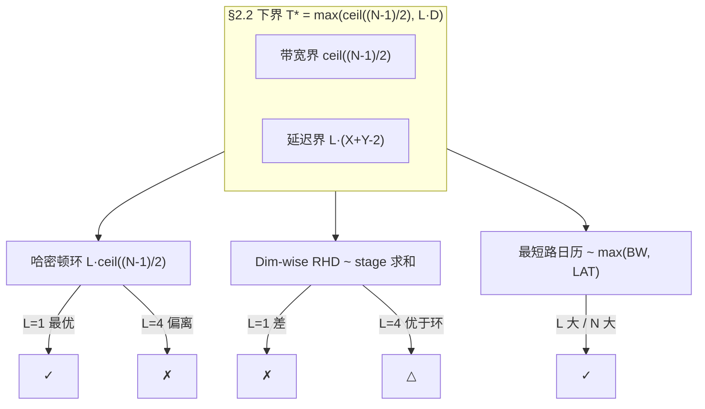

# 时间展开图上的 AllGather：形式化、下界与 L=4 最优性

研究问题：在 2D mesh + TDM 时隙 + bufferless（router 不 stall）约束下，如何把集合通信映射为**无冲突、无合流**的时空连线，并最小化 makespan。

---

## 1. 形式化：长方体 = 时间展开 DAG

设 2D mesh 为 \(G=(V,E)\)，\(V=\{(x,y):0\le x<X,\,0\le y<Y\}\)，\(N=XY\)。

用户描述的「长方体」：\(x,y\) 为 mesh 坐标，\(z\) 为 cycle 时间轴。由于**相邻节点连线需 \(z{+}4\) 才能到达下一跳**，定义：

- **微观时隙** \(z=0,1,2,\ldots\)（cycle）
- **宏观步** \(t=\lfloor z/4\rfloor\)，步长 \(\Delta z=4\)
- 单条有向物理链路在 \([4t,\,4t{+}3]\) 内可各发 1 flit（共 4 flit），即 **链路带宽 = 1 flit/cycle**，**单跳传播延迟 \(L=4\) cycle**

### 1.1 时间展开图 \(G_T\)

构造 DAG：

\[
G_T:\quad \text{顶点 } (v,t),\ t=0,1,\ldots,T;\qquad
\text{弧 } (v,t)\to(w,t{+}1)\iff (v,w)\in E
\]

每条弧对应长方体中一段「\(z\) 到 \(z{+}4\) 的连线」，**容量 = 4 flit**（或归一化为微观模型下每 micro-arc 容量 1）。

### 1.2 四条约束的翻译

| 用户约束 | \(G_T\) 含义 |
|---|---|
| ① 每拍沿 ±x/±y 之一前进，直至到达目的 | 流沿 \(G_T\) 弧前进，**每宏观步恰好一跳、无 hold 弧**（bufferless） |
| ② 每条连线传 4 flit（\(z{+}0\ldots z{+}3\)） | 每弧容量 4 flit；微观等价于 1 flit/cycle 流水 |
| ③ 入边数 ≤ 出边数，小于即多播 | 每流占用弧集为**出树 (arborescence)**：中间点入度 ≤ 1；合流被容量 + 入度双重禁止 |
| ④ 最终 \(z\) 尽量小 | 最小化 makespan \(T_{\mathrm{cyc}}\)（总 cycle 数） |

**问题等价于：** 给定通信需求 \(\{(s_k,D_k)\}\)，在 \(G_T\) 中为每个需求找一棵 Steiner 出树，所有树弧两两不相交（整数多商品不可分流，每弧容量 1 flit/微观 或 4 flit/宏观），最小化 \(T\)。注入相位 \(t_k\) 是调度自由度。

一般情形 NP-hard；但结构化 collective 可闭式构造，且存在通用上界：

- **割下界：** \(T\ge \dfrac{\text{需穿越某割的 flit 数}}{\text{割带宽（flit/cycle）}}\)
- **Leighton–Maggs–Rao (LMR)：** 任意路径系统存在 \(O(C+D)\) 的无冲突时隙表（\(C\)=最大链路负载，\(D\)=最长路径跳数）

---

## 2. AllGather 下界（两种时间模型）

AllGather：每节点持 1 flit，最终每节点持有全部 \(N\) 个 flit。

记 mesh **曼哈顿直径** \(D = X+Y-2\)（角到对角），角节点入度 = 2。

### 2.1 模型 A：\(L=1\)（每跳 1 cycle，弧容量 1 flit/步）

这是 §3 哈密顿环分析所用的**归一化步模型**（每 macro-step = 1 hop = 1 cycle）：

| 下界 | 论证 | 值（步 / cycle） |
|---|---|---|
| 接收度 | 角节点 2 条入链，需收 \(N{-}1\) flit，每步最多 2 | \(T\ge\lceil(N{-}1)/2\rceil\) |
| 直径 | 最远 flit 至少 \(D\) 跳 | \(T\ge D\) |
| 对分 | \(N/2\) flit 须穿过宽 \(Y\) 的割 | \(T\ge X/2\) |

对 4×4、8×8、12×16，**接收度下界占主导**：\(T^\*=\lceil(N{-}1)/2\rceil\)。

### 2.2 模型 B：\(L>1\)（每跳 \(L\) cycle 延迟，1 flit/cycle 流水）

当链路延迟 \(L=4\) 且每条连线 4 cycle 内可灌 4 flit 时，**带宽界与延迟界量纲统一为 cycle**：

| 下界 | 论证 | 值（cycle） |
|---|---|---|
| **带宽 / 接收度** | 角节点持续以 ≤2 flit/cycle 收包 | \(T_{\mathrm{cyc}}\ge\lceil(N{-}1)/2\rceil\) |
| **延迟 / 关键路径** | 最远源到角至少 \(D\) 跳，每跳首 flit 延迟 \(L\) | \(T_{\mathrm{cyc}}\ge L\cdot D\) |
| 对分（弱） | 同上 | \(T_{\mathrm{cyc}}\ge L\cdot X/2\)（通常弱于上两项） |

**综合下界（\(L>1\) 流水模型）：**

\[
\boxed{T^\* \;\gtrsim\; \max\!\Big(\Big\lceil\frac{N-1}{2}\Big\rceil,\; L\cdot(X{+}Y{-}2)\Big)}
\]

> **注：** 当 \(L=1\) 时退化为 §2.1；当 \(L\) 较大或网格较宽时，**延迟项 \(L\cdot D\) 常占主导**，此时以环长为路径的算法会系统性偏离最优。

---

## 3. \(L=1\) 最优构造：双向哈密顿环流水线

**关键观察：** 开放 mesh 瓶颈在角节点度数 2。让角节点两条链路**每步满载收新 flit**，可逼平 §2.1 接收度下界——哈密顿环实现这一点。

### 3.1 蛇形哈密顿环（\(X\) 偶）

```
(0,0)→(0,1)→…→(0,Y-1)        列 0 上行
→(1,Y-1)→…→(1,1)            列 1 下行至 y=1
→(2,1)→…→(2,Y-1)            蛇形交替
→ … →(X-1,1)
→(X-1,0)→…→(0,0)            沿行 0 闭合
```

记环序 \(\pi(0),\ldots,\pi(N{-}1)\)。

### 3.2 时隙表（\(t=0\) 全体注入）

每源拆成顺时针 / 逆时针两线，各走 \(\lceil(N{-}1)/2\rceil\) / \(\lfloor(N{-}1)/2\rfloor\) 跳；途经节点本地落拷贝并继续前传（eject 不占环链路）：

\[
\text{步 } t:\quad
\pi(j)\to\pi(j{+}1)\ \text{载源 }\pi(j{-}t);\qquad
\pi(j)\to\pi(j{-}1)\ \text{载源 }\pi(j{+}t)
\]

（下标 mod \(N\)。）

### 3.3 验证（\(L=1\)）

- **无冲突：** 固定 \(t\)，每环向边恰 1 flit；环边 ↔ 物理边一一对应，利用率 100%。
- **无合流：** 每线为单纯路径 + 本地拷贝。
- **makespan：** 步 \(t\) 结束时每节点持有环距 \(\le t{+}1\) 双侧共 \(2t{+}1\) 个 flit；\(2T{+}1\ge N\Rightarrow T=\lceil(N{-}1)/2\rceil\) = §2.1 下界。**在 \(L=1\) 模型下精确最优。**

几何图像：长方体中 \(2N\) 条螺旋线（顺时针 / 逆时针各 \(N\) 条），每层铺满环两向、互不相交。

### 3.4 边界

- **奇×奇 mesh：** 无哈密顿环；删一角后取环，被绕过节点经邻居代理，makespan +\(O(1)\)。
- **one-port（每步只发一路）：** 改单向环 \(T=N{-}1\)；与约束③（允许多播分叉）矛盾，all-port 才是本意。
- **Torus：** 2 条边不相交哈密顿环 + 双向 ⇒ \(T=\lceil(N{-}1)/4\rceil\)（度数 4 接收下界）。

---

## 4. 哈密顿环在 \(L=4\) 下为何不再最优

将 §3 直接按 cycle 计：

\[
T_{\mathrm{ring}} = L\cdot\Big\lceil\frac{N-1}{2}\Big\rceil
\]

相对 §2.2 下界，环方案同时存在两类损失：

| 损失类型 | 机制 | 后果 |
|---|---|---|
| **关键路径过长** | 环长 \(\approx N/2\) 跳，而非直径 \(D=X{+}Y{-}2\) | 延迟项从 \(L\cdot D\) 膨胀到 \(L\cdot N/2\) |
| **链路聚合度低** | 每 4-cycle 连线块通常只载 **1 个** 在途 flit（单 flit 块流水） | 有效带宽利用率 \(\approx 1/L\)；角节点实际 ingress \(\approx 2/L\) flit/cycle |
| **子图度数浪费** | 环只用度-2 生成子图，内部节点 4 条物理链仅用 2 条 | 全网聚合带宽损失约 50% |

**数值对比（\(L=4\)，open mesh，1 flit/节点）：**

| 尺寸 | \(N\) | 环 \(L\lceil(N{-}1)/2\rceil\) | 下界 \(\max(\lceil(N{-}1)/2\rceil,\,L\cdot D)\) | 环 / 下界 |
|---|---:|---:|---:|---:|
| 4×4 | 16 | 32 | max(8, **24**) = 24 | 1.33× |
| 8×8 | 64 | 128 | max(32, **56**) = 56 | 2.29× |
| 12×16 | 192 | 384 | max(96, **108**) = 108 | 3.56× |
| 16×16 | 256 | 512 | max(128, **120**) = 128 | 4.00× |

**结论：** \(L=1\) 时哈密顿环精确最优；\(L=4\) 时环在延迟与聚合两方面均偏离 §2.2 下界，且**网格越大差距越大**（渐近相对带宽界约差 \(L\) 倍）。

---

## 5. \(L=4\) 下的更优算法

优化目标从「环利用率」转为：

\[
\min\ T_{\mathrm{cyc}}
\quad\text{s.t.}\quad
T_{\mathrm{cyc}} \gtrsim \max\!\Big(\Big\lceil\frac{N-1}{2}\Big\rceil,\; L\cdot D\Big)
\]

核心原则：**缩短关键路径到 \(\approx D\) 跳 + 用超块填满 4-flit 连线管道。**

### 5.1 算法 A：维度聚合（Dim-wise RHD / `buildDimwiseAllgatherFlows`）

两段式，所有交换跳距为 mesh **最近邻**（曼哈顿距离 = stride），关键路径 \(\approx D\) 而非 \(N/2\)：

1. **X 阶段（行内 AllGather）：** 对每行做 pow2-stride 维交换（RHD），块大小逐 stage 翻倍；完成后每节点持有本行 \(X\) 个 flit。
2. **X→Y 切换：** 数据经 PE 落盘再注入（`color_mesh_viz.html` 中 `PE_INOUT_LATENCY` 惩罚）。
3. **Y 阶段（列内 AllGather）：** 以 \(X\)-flit **超块**做列向 RHD；当 \(X\ge L\) 时，**一条 4-cycle 连线可满载 4 flit**，延迟 \(L\) 仅在 \(\lceil(Y{-}1)/2\rceil\) 个 stage 上各付一次。

**单 stage 流水时间（\(L\) 跳距 stride、\(F\) flit/消息）：**

\[
T_{\mathrm{stage}}(s,F) = L\cdot s + (F-1)
\]

（首 flit 走 \(L\cdot s\) cycle 到达；后续 flit 以 1 flit/cycle 流水填满链路。）

**AllGather 总时间（忽略 PE 切换，\(F_0=1\)）：**

\[
T_A \approx \sum_{s\in \mathrm{pow2}(X)} \bigl(L\cdot s + (2^{k(s)}-1)\bigr)
+ \mathrm{PE\_penalty}
+ \sum_{s\in \mathrm{pow2}(Y)} \bigl(L\cdot s + (X\cdot 2^{k(s)}-1)\bigr)
\]

**8×8、\(L=4\)、\(F_0=1\) 估算：**

| 阶段 | stride | flits | \(L\cdot s + (F-1)\) |
|---|---:|---:|---:|
| X | 4 | 1 | 16 |
| X | 2 | 2 | 9 |
| X | 1 | 4 | 7 |
| Y | 4 | 8 | 23 |
| Y | 2 | 16 | 23 |
| Y | 1 | 32 | 35 |
| **小计** | | | **113** (+ PE 切换) |

对比：环 128 cycle，§2.2 下界 56 cycle。**Dim-wise 在 \(L=4\) 下显著优于环，但仍受 Y 阶段列端点（度 1）带宽限制，未逼平延迟下界。**

**与 §3 的交叉：** \(L=1\) 时 dim-wise 在 open mesh 上 \(T\ge N{-}1\)（列端点瓶颈），约为环的 2×；\(L=4\) 时 dim-wise 反超环。**最优算法随 \(L\) 与 \((X,Y)\) 交叉。**

### 5.2 算法 B：最短路全链路日历（方案 5 / LMR 构造）

目标：**同时逼近带宽界与延迟界**——角节点两链路持续满载，且每条 flit 沿 **Manhattan 最短路**（深度 \(\le D\)）前进。

**构造要点：**

1. 对每个目的节点 \(d\)，将 \(N{-}1\) 个外来 flit 按其 2（角）/ 3–4（边、内）条入链**均分**；
2. 每份沿一棵最短路出树 / DAG 汇入 \(d\)，使 hotspot 链路负载 \(C\approx (N{-}1)/2\)，路径深度 \(\le D\)；
3. 由 **LMR 定理**，该路径系统存在无冲突周期日历，周期

\[
T_B = O(C + L\cdot D) \;\approx\; \Big\lceil\frac{N-1}{2}\Big\rceil + L\cdot D \;\text{（常数因子可优化）}
\]

在 pipelining 理想情况下，**可渐近达到**

\[
T_B \;\approx\; \max\!\Big(\Big\lceil\frac{N-1}{2}\Big\rceil,\; L\cdot D\Big) \;=\; T^\* \;(\text{§2.2})
\]

**实现路径（与仓库对齐）：**

- 流量生成：最短路 XY 路由的 \(N(N{-}1)\) 条 unicast 流（或等价多播树分解）；
- 调度：`docs/color_mesh_viz.html` 中 `buildPeriodicCalendar` / `verifyPeriodic`（`perfect_slot_calendar.md`）——周期 \(P=L^\*\)，T=1 刚性对角线；
- 实测：同页求解器在 4×4 / 8×8 AllGather 上 **`P=L^\*=2/5` 时 T=1 可行**（结构化 RHD 是闭式特例；一般最短路日历需更大 \(P\) 或 LMR 松弛）。

**相对算法 A：** 日历不绑定「先 X 后 Y」两阶段，可同时利用**全部 4 个方向**的链路，避免列端点 stage 瓶颈；代价是离线求解 / 更大周期表。

### 5.3 Torus 变体

\(C_X \square C_Y\) 上直径降为 \(\lfloor X/2\rfloor+\lfloor Y/2\rfloor\)，§2.2 延迟项减半；哈密顿环仍走长环，**不改善延迟界**。优先用最短路 + 多环 / 日历。

---

## 6. 三种方案对比与 regime 选择

| 方案 | \(L=1\) makespan | \(L=4\) makespan（8×8） | 硬件状态 | 适用 regime |
|---|---|---:|---|---|
| **双向哈密顿环** | \(\lceil(N{-}1)/2\rceil\) **最优** | 128（2.3× 下界） | 极低（2 条静态转发规则） | \(L=1\)，\(N\) 中等，追求闭式 |
| **Dim-wise RHD** | \(\ge N{-}1\)（~2× 环） | ~113（~2× 下界） | 中（stage 规则 + PE 切换） | \(L\ge 4\)，\(X\ge L\) 超块可聚合 |
| **最短路日历 (LMR)** | \(\approx T^\*\) | \(\approx 56\) **≈ 下界** | 高（周期表 / 相位） | 大 \(N\)、\(L\cdot D\) 主导、追求最优 |



### 6.1 交叉点直觉

- **小网格、\(L=1\)**：带宽界 \(\lceil(N{-}1)/2\rceil\) 主导且 \(\ge L\cdot D\) → **环最优**。
- **\(L=4\)、\(X,Y\ge 8\)**：\(L\cdot D\) 超过 \(\lceil(N{-}1)/2\rceil\) → **延迟界主导**；环因路径长 \(N/2\) 严重吃亏。
- **\(X\ge L\)**：Dim-wise Y 阶段超块可填满 4-flit 管道 → 相对环的改善来自**聚合**；相对日历仍受列端点度-1 限制。

---

## 7. 嵌入日历框架（方案 5）

| 方案 | 周期 \(P\) | 注入相位 | 验证 |
|---|---|---|---|
| 哈密顿环 | \(\lceil(N{-}1)/2\rceil\) | 全 0 | §3.3 闭式 |
| Dim-wise RHD | stage 累加（非单一 \(P\)） | 按 stage `release` | `buildDimwiseAllgatherFlows` |
| 最短路日历 | \(P=L^\*\)（求解器） | 相位 `{phi_f}` | `verifyPeriodic` |

`perfect_slot_calendar.md` 记录：内置 AllGather 在 4×4 / 8×8 上 **`P=L^\*`、T=1 可行**——证明「刚性对角线 + 相位」可达成无 stall 稳态，与本文 bufferless 模型一致。

---

## 8. 后续工作（代码侧）

1. 在 `collective_patterns.py` 中为 Dim-wise / 最短路日历增加 `link_latency=L` 参数化 makespan 估算；
2. 8×8 / 12×16 上数值对拍：环 vs dim-wise vs 日历，验证 §6 表格；
3. 将 §2.2 下界集成进 `analyze_collective` 作为 `T*` 证书。

---

## 参考文献（概念层）

- Leighton, Maggs, Rao: *Universal Packet Routing Algorithms*（\(O(C+D)\) 调度）
- 项目内：`docs/perfect_slot_calendar.md`、`docs/color_mesh_viz.html`（`buildDimwiseAllgatherFlows`、`buildPeriodicCalendar`）
- 仿真参数：`link_latency_cycles`（`wsesim/core/config.py`），单跳 cycle 模型 `link_cycles = L + ceil(flits/bw)`（`wsesim/network/network.py`）
